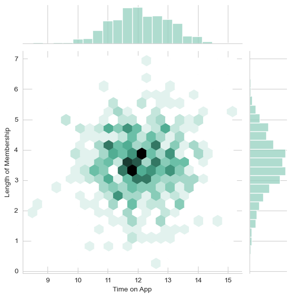
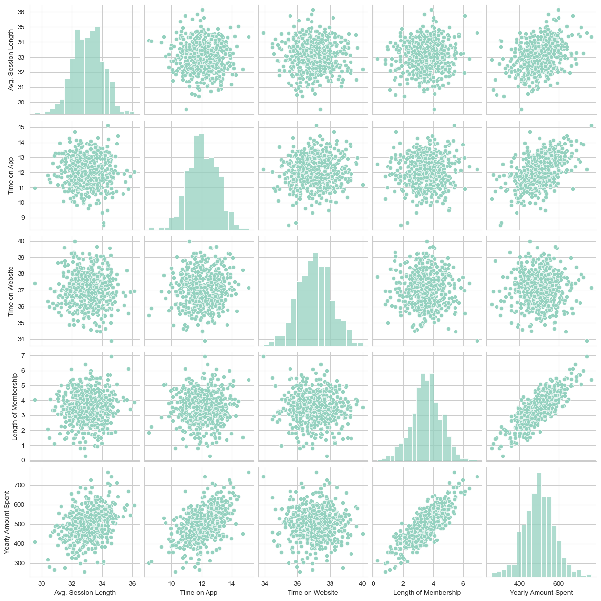
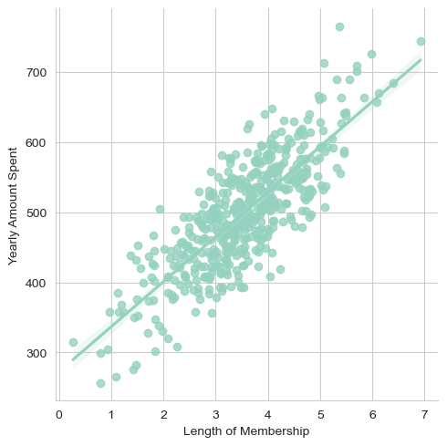
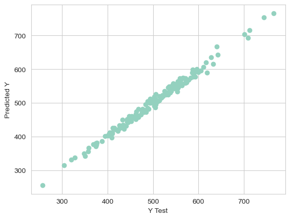

# Ecommerce Storefront Linear Regression and Data Analysis

## Description

An online clothing retailer in New York City operates by running a small in-person gallery where customers can see and try on clothes before making their order either on a mobile app or a website. The company is hoping to increase their sales by improving the customer experience on their their online storefronts but due to budget restrictions, they can only focus on one online storefront at this current time. By analyzing customer purchase data, we can use linear regression to model which storefront the company should work on improving first.

## Code


```python
# imports
import pandas as pd
import numpy as np
import matplotlib.pyplot as plt
import seaborn as sns
%matplotlib inline
```

### Getting the Data

The data that we will be working with contains past purchase with information such as emails, address, avatar, average session length, time on application, time on website, length of membership, and yearly amount. We will be using the quantitative data to make our model and analysis. *Disclaimer, this data is not real*


```python
# Reading in data
customers = pd.read_csv("Ecommerce Customers")
```


```python
customers.head()
```


<div>
<table border="1" class="dataframe">
  <thead>
    <tr style="text-align: right;">
      <th></th>
      <th>Email</th>
      <th>Address</th>
      <th>Avatar</th>
      <th>Avg. Session Length</th>
      <th>Time on App</th>
      <th>Time on Website</th>
      <th>Length of Membership</th>
      <th>Yearly Amount Spent</th>
    </tr>
  </thead>
  <tbody>
    <tr>
      <th>0</th>
      <td>mstephenson@fernandez.com</td>
      <td>835 Frank Tunnel\nWrightmouth, MI 82180-9605</td>
      <td>Violet</td>
      <td>34.497268</td>
      <td>12.655651</td>
      <td>39.577668</td>
      <td>4.082621</td>
      <td>587.951054</td>
    </tr>
    <tr>
      <th>1</th>
      <td>hduke@hotmail.com</td>
      <td>4547 Archer Common\nDiazchester, CA 06566-8576</td>
      <td>DarkGreen</td>
      <td>31.926272</td>
      <td>11.109461</td>
      <td>37.268959</td>
      <td>2.664034</td>
      <td>392.204933</td>
    </tr>
    <tr>
      <th>2</th>
      <td>pallen@yahoo.com</td>
      <td>24645 Valerie Unions Suite 582\nCobbborough, D...</td>
      <td>Bisque</td>
      <td>33.000915</td>
      <td>11.330278</td>
      <td>37.110597</td>
      <td>4.104543</td>
      <td>487.547505</td>
    </tr>
    <tr>
      <th>3</th>
      <td>riverarebecca@gmail.com</td>
      <td>1414 David Throughway\nPort Jason, OH 22070-1220</td>
      <td>SaddleBrown</td>
      <td>34.305557</td>
      <td>13.717514</td>
      <td>36.721283</td>
      <td>3.120179</td>
      <td>581.852344</td>
    </tr>
    <tr>
      <th>4</th>
      <td>mstephens@davidson-herman.com</td>
      <td>14023 Rodriguez Passage\nPort Jacobville, PR 3...</td>
      <td>MediumAquaMarine</td>
      <td>33.330673</td>
      <td>12.795189</td>
      <td>37.536653</td>
      <td>4.446308</td>
      <td>599.406092</td>
    </tr>
  </tbody>
</table>
</div>


```python
customers.describe()
```


<div>
<table border="1" class="dataframe">
  <thead>
    <tr style="text-align: right;">
      <th></th>
      <th>Avg. Session Length</th>
      <th>Time on App</th>
      <th>Time on Website</th>
      <th>Length of Membership</th>
      <th>Yearly Amount Spent</th>
    </tr>
  </thead>
  <tbody>
    <tr>
      <th>count</th>
      <td>500.000000</td>
      <td>500.000000</td>
      <td>500.000000</td>
      <td>500.000000</td>
      <td>500.000000</td>
    </tr>
    <tr>
      <th>mean</th>
      <td>33.053194</td>
      <td>12.052488</td>
      <td>37.060445</td>
      <td>3.533462</td>
      <td>499.314038</td>
    </tr>
    <tr>
      <th>std</th>
      <td>0.992563</td>
      <td>0.994216</td>
      <td>1.010489</td>
      <td>0.999278</td>
      <td>79.314782</td>
    </tr>
    <tr>
      <th>min</th>
      <td>29.532429</td>
      <td>8.508152</td>
      <td>33.913847</td>
      <td>0.269901</td>
      <td>256.670582</td>
    </tr>
    <tr>
      <th>25%</th>
      <td>32.341822</td>
      <td>11.388153</td>
      <td>36.349257</td>
      <td>2.930450</td>
      <td>445.038277</td>
    </tr>
    <tr>
      <th>50%</th>
      <td>33.082008</td>
      <td>11.983231</td>
      <td>37.069367</td>
      <td>3.533975</td>
      <td>498.887875</td>
    </tr>
    <tr>
      <th>75%</th>
      <td>33.711985</td>
      <td>12.753850</td>
      <td>37.716432</td>
      <td>4.126502</td>
      <td>549.313828</td>
    </tr>
    <tr>
      <th>max</th>
      <td>36.139662</td>
      <td>15.126994</td>
      <td>40.005182</td>
      <td>6.922689</td>
      <td>765.518462</td>
    </tr>
  </tbody>
</table>
</div>


```python
customers.info()
```

    <class 'pandas.core.frame.DataFrame'>
    RangeIndex: 500 entries, 0 to 499
    Data columns (total 8 columns):
     #   Column                Non-Null Count  Dtype  
    ---  ------                --------------  -----  
     0   Email                 500 non-null    object 
     1   Address               500 non-null    object 
     2   Avatar                500 non-null    object 
     3   Avg. Session Length   500 non-null    float64
     4   Time on App           500 non-null    float64
     5   Time on Website       500 non-null    float64
     6   Length of Membership  500 non-null    float64
     7   Yearly Amount Spent   500 non-null    float64
    dtypes: float64(5), object(3)
    memory usage: 31.4+ KB
    

### Exploratory Data Analysis


```python
sns.set_palette("GnBu_d")
sns.set_style('whitegrid')
sns.jointplot(x='Time on Website',y='Yearly Amount Spent',data=customers)
```


    <seaborn.axisgrid.JointGrid at 0x2241176db10>


    

    


```python
sns.jointplot(x='Time on App',y='Yearly Amount Spent',data=customers)
```


    <seaborn.axisgrid.JointGrid at 0x22411a6ab10>


    

    


```python
sns.jointplot(x='Time on App',y='Length of Membership',kind='hex',data=customers)
```


    <seaborn.axisgrid.JointGrid at 0x2240f495810>


    

    


```python
sns.pairplot(customers)
```


    <seaborn.axisgrid.PairGrid at 0x22411a54c90>


    

    


Interestingly, we can see that the data point that correlates most with Yearly Amount Spent is the length of membership. Let's explore this.


```python
sns.lmplot(x='Length of Membership',y='Yearly Amount Spent',data=customers)
```


    <seaborn.axisgrid.FacetGrid at 0x23275fbd390>


    

    


As we can see, the length of membership is nearly directly correlated to the Yearly Amount Spent by customers.

### Training and Testing the Model


```python
X = customers[['Avg. Session Length', 'Time on App','Time on Website', 'Length of Membership']]
y = customers['Yearly Amount Spent']
```


```python
from sklearn.model_selection import train_test_split
X_train, X_test, y_train, y_test = train_test_split(X, y, test_size=0.3, random_state=101)
```


```python
from sklearn.linear_model import LinearRegression
```


```python
lm = LinearRegression()
lm.fit(X_train,y_train)
```

```python
print('Coefficients: \n', lm.coef_)
```

    Coefficients: 
     [25.98154972 38.59015875  0.19040528 61.27909654]
    


```python
predictions = lm.predict( X_test)
```


```python
plt.scatter(y_test,predictions)
plt.xlabel('Y Test')
plt.ylabel('Predicted Y')
```


    Text(0, 0.5, 'Predicted Y')


    

    


### Evaluation


```python
from sklearn import metrics

print('MAE:', metrics.mean_absolute_error(y_test, predictions))
print('MSE:', metrics.mean_squared_error(y_test, predictions))
print('RMSE:', np.sqrt(metrics.mean_squared_error(y_test, predictions)))
```

    MAE: 7.2281486534308295
    MSE: 79.81305165097444
    RMSE: 8.933815066978633
    

With a Root Mean Squared Error 71x less than the mean Yearly Amount Spent, we can be confident in the Linear Regression model that we trained.


```python
sns.displot((y_test-predictions),bins=50);
```


    

    


```python
coeffecients = pd.DataFrame(lm.coef_,X.columns)
coeffecients.columns = ['Coeffecient']
coeffecients
```


<div>
<table border="1" class="dataframe">
  <thead>
    <tr style="text-align: right;">
      <th></th>
      <th>Coeffecient</th>
    </tr>
  </thead>
  <tbody>
    <tr>
      <th>Avg. Session Length</th>
      <td>25.981550</td>
    </tr>
    <tr>
      <th>Time on App</th>
      <td>38.590159</td>
    </tr>
    <tr>
      <th>Time on Website</th>
      <td>0.190405</td>
    </tr>
    <tr>
      <th>Length of Membership</th>
      <td>61.279097</td>
    </tr>
  </tbody>
</table>
</div>


### Interpretation

- Holding all other features fixed, a 1 unit increase in **Avg. Session Length** is associated with an **increase of 25.98 total dollars spent**.
- Holding all other features fixed, a 1 unit increase in **Time on App** is associated with an **increase of 38.59 total dollars spent**.
- Holding all other features fixed, a 1 unit increase in **Time on Website** is associated with an **increase of 0.19 total dollars spent**.
- Holding all other features fixed, a 1 unit increase in **Length of Membership** is associated with an **increase of 61.27 total dollars spent**.

This means that the Length of Membership was the factor that had to greatest affect on customer spending, while Time on Website had the least affect. Intuitively, this can be interpreted to mean that the company should create better incentives for users to sign up and engage with the membership system in order to increase spending. This information can be interpreted in different ways however. In the case of Length of Membership, will constantly improving the membership system always increase customer spending and will it come at a cost? Perhaps Time on Website as the weakest factor to customer spending could indicate that there is untapped potential in improving website functionality and experience which could drive more spending.
